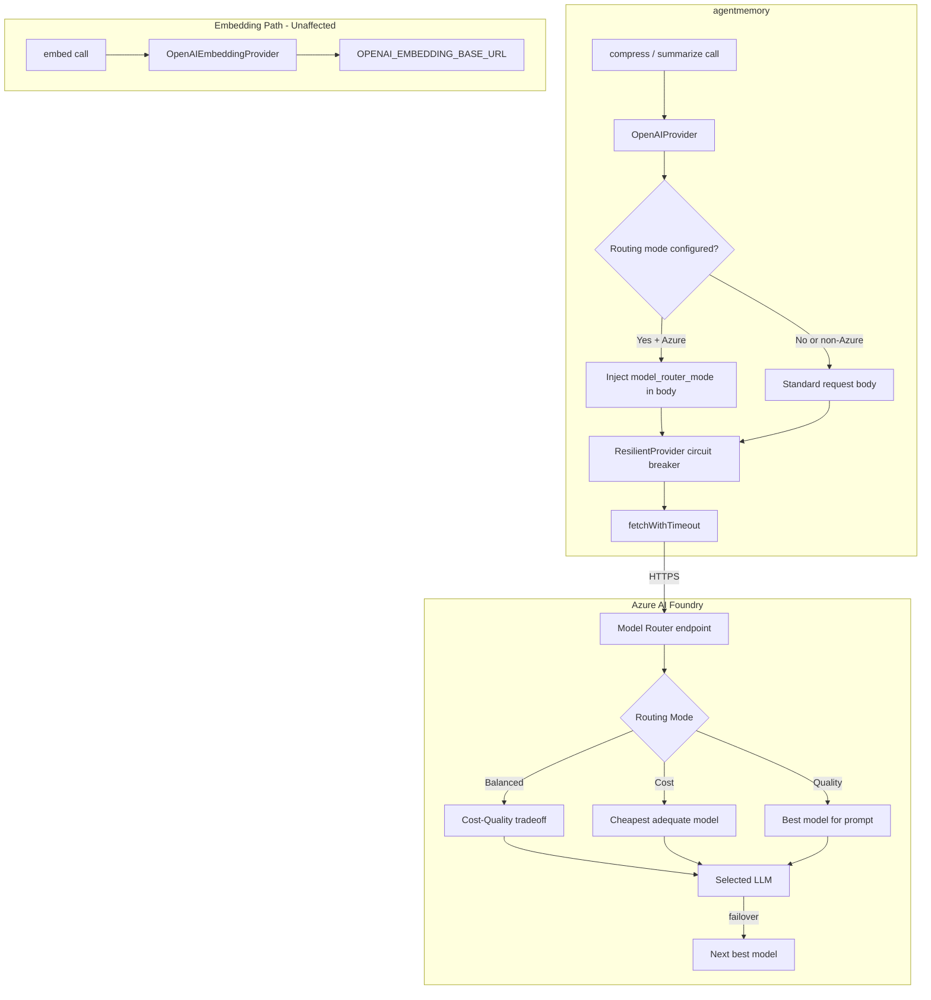
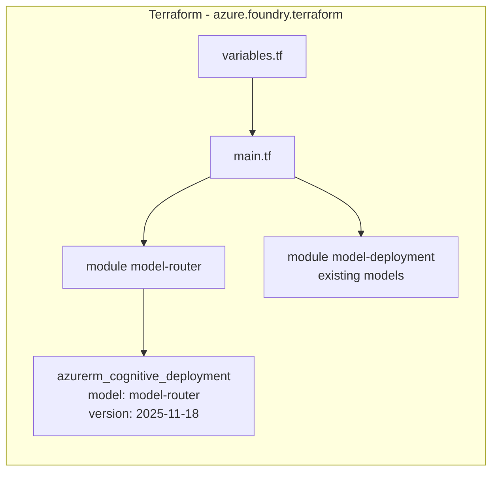

# Design Document: Model Router Integration

## Overview

This design integrates Azure AI Foundry's Model Router into agentmemory's LLM provider system. Model Router is a trained language model deployed as a single Azure OpenAI endpoint that analyzes prompts in real-time and routes them to the optimal underlying LLM based on configurable routing modes (Balanced, Cost, Quality). It provides built-in automatic failover across its model subset, prompt caching, and an OpenAI-compatible `/v1/chat/completions` interface.

The integration touches two codebases:

1. **agentmemory** (TypeScript/ESM) — Minimal modifications to the existing `OpenAIProvider`: inject `model_router_mode` into the request body when routing mode is configured, and add observability logging for the actual serving model. A new helper function resolves the routing mode from the environment variable.
2. **azure.foundry.terraform** — Add a new `model-router` module that provisions the Model Router deployment as an `azurerm_cognitive_deployment` resource alongside existing model deployments.

Key design decisions:
- **No new provider class** — Model Router exposes an OpenAI-compatible endpoint, so the existing `OpenAIProvider` handles it natively. Only the request body needs conditional `model_router_mode` injection.
- **No fallback chain changes** — In Model Router deployments, `FALLBACK_PROVIDERS` is simply not set, so the existing code path in `createFallbackProvider()` naturally skips the fallback chain. No application code changes are needed to disable it.
- **Circuit breaker retained** — The `ResilientProvider` wrapper remains active to protect against endpoint-level failures (network, DNS, region outages) that Model Router's internal failover cannot handle.
- **Embedding isolation** — Embeddings use `OPENAI_EMBEDDING_BASE_URL` (already independent) and are never routed through Model Router.

## Architecture





## Components and Interfaces

### 1. OpenAIProvider Modifications (`src/providers/openai.ts`)

The existing `OpenAIProvider` class gains routing mode awareness, response flag parsing, and observability logging:

```typescript
interface OpenAIProviderConfig {
  apiKey: string;
  model: string;
  maxTokens: number;
  baseURL?: string;
  routingMode?: "cost" | "balanced" | "quality"; // NEW
}
```

Changes to the `call()` method:
- If `this.isAzure && this.routingMode` is set, inject `model_router_mode` field into the request body.
- After receiving a 200 response, parse the JSON body and check for Model Router response flags:
  - If `response_successful === false` or `model_router_response_received === false`, treat it as a failure (record circuit breaker failure, throw error with status + body truncated to 200 chars).
  - Otherwise, record circuit breaker success and log the response's `model` field (actual serving model) to stderr for observability.
- If `response.json()` throws (malformed body), catch the parse error, record circuit breaker failure, and throw with the raw text prefix.

No new class is needed — the OpenAI-compatible wire format is identical.

### 2. Routing Mode Resolution (`src/providers/_openai-shared.ts`)

New exported function:

```typescript
export function resolveRoutingMode(
  envValue: string | undefined,
  isAzure: boolean,
): "cost" | "balanced" | "quality" | undefined {
  if (!envValue || !isAzure) return undefined;
  const normalized = envValue.trim().toLowerCase();
  const valid = ["cost", "balanced", "quality"] as const;
  if (valid.includes(normalized as any)) {
    return normalized as "cost" | "balanced" | "quality";
  }
  process.stderr.write(
    `[agentmemory] Unrecognized MODEL_ROUTER_ROUTING_MODE="${envValue}". ` +
    `Valid values: cost, balanced, quality. Omitting routing mode.\n`
  );
  return undefined;
}
```

### 3. Terraform Module: `modules/model-router/`

New module structure:
```
modules/model-router/
├── main.tf          # azurerm_cognitive_deployment resource
├── variables.tf     # model_router_config input
├── outputs.tf       # endpoint URL, deployment name
```

**Interface (variables.tf):**
```hcl
variable "cognitive_account_id" {
  type = string
}

variable "model_router_config" {
  type = object({
    enabled      = bool
    routing_mode = string
    model_subset = list(string)
    capacity     = number
  })
}

variable "model_deployment_names" {
  description = "Names from the model_deployments list, used for subset validation"
  type        = list(string)
}
```

**Resource (main.tf):**
```hcl
resource "azurerm_cognitive_deployment" "model_router" {
  count                = var.model_router_config.enabled ? 1 : 0
  name                 = "model-router"
  cognitive_account_id = var.cognitive_account_id
  rai_policy_name      = "Microsoft.DefaultV2"

  model {
    format  = "OpenAI"
    name    = "model-router"
    version = "2025-11-18"
  }

  sku {
    name     = "GlobalStandard"
    capacity = var.model_router_config.capacity
  }
}
```

**Outputs (outputs.tf):**
```hcl
output "model_router_endpoint" {
  value = var.model_router_config.enabled ? "https://${split("/", var.cognitive_account_id)[8]}.openai.azure.com" : null
}

output "model_router_deployment_name" {
  value = var.model_router_config.enabled ? azurerm_cognitive_deployment.model_router[0].name : null
}
```

### 4. Root Module Integration (`main.tf`, `variables.tf`, `outputs.tf`)

New variable in root:
```hcl
variable "model_router_config" {
  type = object({
    enabled      = bool
    routing_mode = string
    model_subset = list(string)
    capacity     = number
  })
  default = {
    enabled      = false
    routing_mode = "balanced"
    model_subset = []
    capacity     = 50
  }
}
```

New module call in `main.tf`:
```hcl
module "model_router" {
  source                 = "./modules/model-router"
  cognitive_account_id   = module.ai_services.cognitive_account_id
  model_router_config    = var.model_router_config
  model_deployment_names = [for d in var.model_deployments : d.name]
}
```

### 5. Terraform Validations (`modules/model-router/variables.tf`)

```hcl
variable "model_router_config" {
  type = object({
    enabled      = bool
    routing_mode = string
    model_subset = list(string)
    capacity     = number
  })

  validation {
    condition     = var.model_router_config.capacity >= 1 && var.model_router_config.capacity <= 10000
    error_message = "capacity must be between 1 and 10000 (thousands of tokens-per-minute)."
  }

  validation {
    condition     = !var.model_router_config.enabled || length(var.model_router_config.model_subset) >= 1
    error_message = "model_subset must contain at least one model deployment name when enabled."
  }

  validation {
    condition     = length(var.model_router_config.model_subset) <= 20
    error_message = "model_subset must contain at most 20 model deployment names."
  }
}
```

### 6. Terraform Region Validation

The parent AI Services account module validates region support:

```hcl
variable "location" {
  type = string
  validation {
    condition     = contains(["eastus2", "swedencentral"], var.location)
    error_message = "Model Router is only supported in eastus2 and swedencentral regions."
  }
}
```

## Data Models

### Request Body (Model Router mode active)

When routing mode is configured and the endpoint is Azure:

```json
{
  "model": "model-router",
  "max_tokens": 4096,
  "stream": false,
  "model_router_mode": "balanced",
  "messages": [
    { "role": "system", "content": "..." },
    { "role": "user", "content": "..." }
  ]
}
```

When routing mode is NOT configured or endpoint is non-Azure, `model_router_mode` is omitted entirely (standard OpenAI payload).

### Response Body (Model Router)

```json
{
  "id": "chatcmpl-...",
  "object": "chat.completion",
  "model": "gpt-4.1-nano",
  "choices": [
    {
      "index": 0,
      "message": {
        "role": "assistant",
        "content": "..."
      },
      "finish_reason": "stop"
    }
  ],
  "usage": {
    "prompt_tokens": 42,
    "completion_tokens": 128,
    "total_tokens": 170
  }
}
```

The `model` field in the response reflects the actual model that served the request (not `model-router`).

### Terraform Variable Structure

```hcl
# model_router_config object
{
  enabled      = true
  routing_mode = "balanced"        # "cost" | "balanced" | "quality"
  model_subset = ["gpt-4-1-nano"]  # must reference names in model_deployments
  capacity     = 50                # 1-10000 (thousands of TPM)
}
```

### Environment Variables (agentmemory)

| Variable | Purpose | Default |
|----------|---------|---------|
| `OPENAI_BASE_URL` | Model Router endpoint (e.g. `https://myresource.openai.azure.com`) | `https://api.openai.com` |
| `OPENAI_API_KEY` | Azure AI Services key | (required) |
| `OPENAI_MODEL` | Deployment name (e.g. `model-router`) | `gpt-4o-mini` |
| `MODEL_ROUTER_ROUTING_MODE` | Routing optimization: `cost`, `balanced`, `quality` | (omitted = Azure default) |
| `OPENAI_EMBEDDING_BASE_URL` | Embedding endpoint (independent of LLM path) | falls back to `OPENAI_BASE_URL` |

## Correctness Properties

*A property is a characteristic or behavior that should hold true across all valid executions of a system — essentially, a formal statement about what the system should do. Properties serve as the bridge between human-readable specifications and machine-verifiable correctness guarantees.*

### Property 1: Azure detection produces correct auth headers

*For any* URL whose hostname ends with `.openai.azure.com`, the `buildAuthHeaders` function SHALL return an `api-key` header with the provided key value. *For any* URL whose hostname does NOT end with `.openai.azure.com`, it SHALL return an `Authorization: Bearer` header.

**Validates: Requirements 2.1**

### Property 2: Azure v1 URL construction

*For any* Azure base URL (hostname ending in `.openai.azure.com`) that does NOT contain a `/openai/deployments/` path segment, `buildChatUrl` SHALL produce a URL with the path `/openai/v1/chat/completions` and no `api-version` query parameter.

**Validates: Requirements 2.2**

### Property 3: Model name passthrough in request body

*For any* non-empty model name string, the constructed request body SHALL contain a `model` field whose value is exactly that string.

**Validates: Requirements 2.3**

### Property 4: Routing mode conditional injection

*For any* Azure endpoint with a valid routing mode set (one of "cost", "balanced", "quality" in any casing), the request body SHALL include a `model_router_mode` field with the lowercased value. *For any* non-Azure endpoint OR when routing mode is unset, the request body SHALL NOT contain a `model_router_mode` field.

**Validates: Requirements 2.4, 3.1, 3.2, 3.3**

### Property 5: Invalid routing mode fallback

*For any* string that is not case-insensitively equal to "cost", "balanced", or "quality", `resolveRoutingMode` SHALL return `undefined` (causing omission of `model_router_mode` from the request body).

**Validates: Requirements 3.4**

### Property 6: Embedding path isolation from Model Router

*For any* configuration where `OPENAI_BASE_URL` points to an Azure Model Router endpoint and `OPENAI_EMBEDDING_BASE_URL` is set to a different value, the `OpenAIEmbeddingProvider` SHALL resolve its base URL from `OPENAI_EMBEDDING_BASE_URL` and never from `OPENAI_BASE_URL`.

**Validates: Requirements 4.1, 4.3, 4.4**

### Property 7: Embedding dimension guard

*For any* embedding vector whose length differs from the provider's configured `dimensions` value, the `withDimensionGuard` wrapper SHALL throw an error containing the expected and actual dimension counts.

**Validates: Requirements 4.5**

### Property 8: Circuit breaker state transitions

*For any* sequence of N consecutive failures (N ≥ 3) occurring within a 60-second window, the circuit breaker SHALL transition to the "open" state and reject subsequent calls. After 30 seconds in the "open" state, it SHALL transition to "half-open" and allow one trial call.

**Validates: Requirements 2.6**

### Property 9: Error response handling with body truncation

*For any* HTTP response with a non-2xx status code and a response body of arbitrary length, the thrown error message SHALL contain the numeric status code AND the response body truncated to at most 200 characters. Additionally, *for any* response where the body is not valid JSON (malformed/unparseable), the provider SHALL throw an error and record a circuit breaker failure.

**Validates: Requirements 2.5, 5.4**

### Property 10: Success response model logging

*For any* successful HTTP 200 response containing a `model` field in the JSON body, the provider SHALL write a log line to stderr that includes both the requested model name (from the request) and the actual model name (from the response).

**Validates: Requirements 5.1**

## Error Handling

### HTTP Error Responses from Model Router

| Status Code | Meaning | Provider Behavior |
|-------------|---------|-------------------|
| 200 | Success (possibly after internal failover) | Parse response body; if `response_successful` flag is `false` or `model_router_response_received` is `false`, record failure + throw with status + body. Otherwise record circuit breaker success, extract content, log actual model |
| 200 (unparseable body) | Malformed JSON response | Record failure, throw with status + raw text prefix (truncated 200 chars) |
| 400 | Bad request (malformed payload) | Record failure, throw with status + body (truncated 200 chars) |
| 401/403 | Auth failure | Record failure, throw with status + body |
| 404 | Deployment not found | Record failure, throw with status + body |
| 429 | Rate limited | Record failure, throw with status code |
| 500 | Internal server error | Record failure, throw with status + body |
| 503 | Service unavailable | Record failure, throw with status code |
| Network timeout | `fetchWithTimeout` abort | Record failure, throw timeout error |

### Circuit Breaker Behavior

- **Failure threshold**: 3 failures within 60 seconds → circuit opens
- **Open state**: All calls rejected immediately with `circuit_breaker_open` error
- **Recovery**: After 30 seconds, circuit transitions to half-open, allows one trial call
- **Half-open success**: Circuit closes, failure counter resets
- **Half-open failure**: Circuit re-opens for another 30 seconds

### Timeout and Malformed Response Handling

The existing `fetchWithTimeout` mechanism applies unchanged:

- Default: 60,000ms (overridable via `OPENAI_TIMEOUT_MS` or `AGENTMEMORY_LLM_TIMEOUT_MS`)
- Timeout triggers `AbortError` → caught and re-thrown as descriptive timeout error
- Timeout counts as a circuit breaker failure

Additionally, if the response body cannot be parsed as JSON (e.g., `response.json()` throws a `SyntaxError`), the provider SHALL:
1. Catch the parse error
2. Throw a descriptive error including the HTTP status code and a prefix of the raw response text (truncated to 200 characters)
3. Record the failure as a circuit breaker failure

This ensures that network timeouts, malformed/unparseable responses, and non-2xx HTTP status codes are all treated uniformly as circuit breaker failures per Requirement 2.5.

### Startup Validation Errors

| Condition | Behavior |
|-----------|----------|
| `MODEL_ROUTER_ROUTING_MODE` is unrecognized | Log warning to stderr, continue without routing mode |
| `OPENAI_BASE_URL` is not a valid URL | Existing behavior unchanged — provider uses it as-is |
| `OPENAI_API_KEY` is empty | Throw at provider construction (existing behavior) |

### Terraform Validation Errors

| Condition | Error Type |
|-----------|------------|
| Region not in [eastus2, swedencentral] | Variable validation error at `terraform plan` |
| `model_subset` is empty when enabled | Variable validation error at `terraform plan` |
| `model_subset` entry not in `model_deployments` | Precondition error at `terraform plan` |
| `capacity` outside 1–10000 range | Variable validation error at `terraform plan` |

## Testing Strategy

### Unit Tests (vitest)

Unit tests cover specific examples, edge cases, and integration points. These use the existing `vitest` setup in agentmemory.

**Provider logic tests:**
- Azure detection: hostname `.openai.azure.com` → `true`, all others → `false`
- URL building: v1 style when no `/deployments/` in path, legacy style when present
- Auth header construction: `api-key` for Azure, `Bearer` for standard
- Routing mode resolution: valid values (case-insensitive), invalid values, unset
- Error handling: 429/503 specific behavior, body truncation at 200 chars
- Response logging: stderr output includes model names

**Embedding isolation tests:**
- `OPENAI_EMBEDDING_BASE_URL` takes precedence over `OPENAI_BASE_URL`
- Dimension guard rejects wrong-size vectors

**Circuit breaker tests:**
- Existing tests already cover the state machine (threshold=3, window=60s, recovery=30s)

### Property-Based Tests (vitest + fast-check)

Property-based tests verify universal properties across randomized inputs. Use `fast-check` library with vitest.

**Configuration**: Each property test runs a minimum of 100 iterations.

**Tag format**: `Feature: model-router-integration, Property N: <title>`

| Property | What It Tests | Generator Strategy |
|----------|--------------|-------------------|
| P1: Auth headers | `buildAuthHeaders` | Random hostnames ending/not-ending with `.openai.azure.com` |
| P2: v1 URL construction | `buildChatUrl` | Random Azure base URLs without `/deployments/` path |
| P3: Model name passthrough | Request body construction | Random non-empty strings |
| P4: Routing mode injection | Request body `model_router_mode` field | Random valid modes × (Azure/non-Azure URLs) |
| P5: Invalid routing mode | `resolveRoutingMode` | Random strings excluding "cost"/"balanced"/"quality" |
| P6: Embedding isolation | `OpenAIEmbeddingProvider` base URL resolution | Random (embedding URL, LLM URL) pairs |
| P7: Dimension guard | `withDimensionGuard` | Random Float32Arrays with wrong lengths |
| P8: Circuit breaker | `CircuitBreaker` state machine | Random sequences of success/failure with timestamps |
| P9: Error truncation | Error message construction | Random status codes × random strings of varying length |
| P10: Success logging | Log output on 200 | Random model name pairs |

### Terraform Tests

Terraform tests use `terraform validate` and `terraform plan` (no apply in CI):

- **Validate**: Module compiles with valid variable shapes
- **Plan (enabled=true)**: Verify `azurerm_cognitive_deployment` resource appears with correct attributes
- **Plan (enabled=false)**: Verify zero Model Router resources
- **Validation errors**: Unsupported region, empty subset, capacity out of range, subset name mismatch

### Integration Tests (manual / CI pipeline)

These verify end-to-end behavior with a real Azure endpoint (excluded from `npm test`):

- Deploy Model Router via Terraform → configure agentmemory → verify compress/summarize calls succeed
- Verify response `model` field shows actual serving model (not "model-router")
- Verify embedding calls are unaffected by Model Router configuration
- Verify circuit breaker opens after sustained failures and recovers
