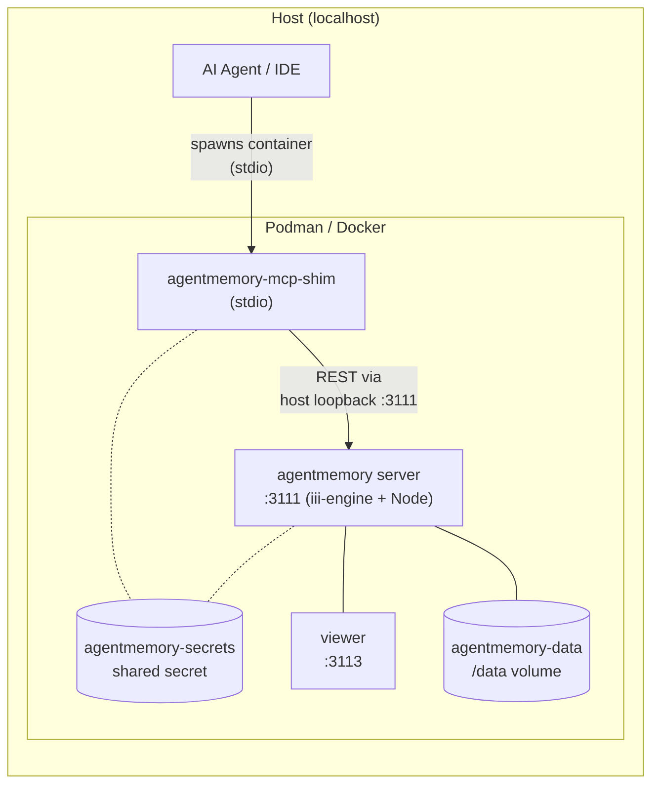

# agentmemory — Local Container Deploy

Run agentmemory as a persistent container (Podman or Docker) on your
workstation. Connect any MCP-compatible agent directly, or route tool
calls through an MCP Gateway.

## Architecture



**How it works:**
- The **agentmemory** container runs the full server (iii-engine v0.11.2 +
  Node worker + local embeddings) bound to `localhost:3111` and `:3113` (viewer).
- Your **agent** (Claude Code, Cursor, Kiro, VS Code, etc.) spawns the
  pre-built `agentmemory-mcp-shim` container as a stdio MCP server.
- The **shim** proxies MCP tool calls to the agentmemory REST API via the
  host loopback address (`host.containers.internal` for Podman,
  `host.docker.internal` for Docker).
- The **secrets volume** is shared between the server and shim — the HMAC
  secret never leaves the volume layer.
- If you use an **MCP Gateway**, the gateway spawns the shim instead of
  your agent doing it directly.

## Quick Start

Both scripts auto-detect whether `podman` or `docker` is available.
You can also pass the engine explicitly.

### PowerShell (Windows)

```powershell
cd deploy\container-local
.\setup.ps1                  # auto-detect
.\setup.ps1 -Engine podman   # force podman
.\setup.ps1 -Engine docker   # force docker
```

### Bash (macOS / Linux / WSL)

```bash
cd deploy/container-local
chmod +x setup.sh
./setup.sh              # auto-detect
./setup.sh podman       # force podman
./setup.sh docker       # force docker
```

Both scripts:
1. Build the `agentmemory` server image and the `agentmemory-mcp-shim` image
2. Create persistent `agentmemory-data` and `agentmemory-secrets` volumes
3. Start the server container with `--restart unless-stopped`
4. Wait for health check
5. Print the `gateway.yaml` snippet to add

## Manual Steps

Replace `podman` with `docker` in all commands below if using Docker.

### 1. Build the images

```bash
cd deploy/container-local
podman build --load -t agentmemory -f Dockerfile .
podman build --load -t agentmemory-mcp-shim -f Dockerfile.mcp-shim .
```

> Docker does not need `--load` — omit it if using `docker build`.

### 2. Create volumes and run

```bash
podman volume create agentmemory-data
podman volume create agentmemory-secrets

podman run -d \
    --name agentmemory \
    --restart unless-stopped \
    -p "127.0.0.1:3111:3111" \
    -p "127.0.0.1:3113:3113" \
    -v "agentmemory-data:/data" \
    -v "agentmemory-secrets:/secrets" \
    agentmemory
```

### 3. Secret management

The HMAC secret is generated inside the container on first boot and stored
in the `agentmemory-secrets` volume. It never leaves the volume layer —
you don't need to read or copy it. Both the server and the shim mount the
same volume.

To rotate: delete the secrets volume and restart:
```bash
podman rm -f agentmemory
podman volume rm agentmemory-secrets
./setup.sh   # or .\setup.ps1
```

### 4. Verify

```bash
curl http://localhost:3111/agentmemory/health
```

### 5. Add to MCP Gateway

Add this backend to `~/.mcp-gateway/gateway.yaml` under `servers:`.

The gateway spawns the pre-built `agentmemory-mcp-shim` image as a stdio
backend. The shim connects to the agentmemory server via the host loopback.

The secret is stored in a dedicated `agentmemory-secrets` volume, separate
from the data volume. The shim mounts only the secrets volume read-only —
the data volume (SQLite, embeddings, streams) is never exposed:

**Podman:**
```yaml
  agentmemory:
    transport: stdio
    command: podman
    args:
      - run
      - --rm
      - -i
      - -e
      - AGENTMEMORY_URL=http://host.containers.internal:3111
      - -v
      - agentmemory-secrets:/run/secrets:ro
      - agentmemory-mcp-shim
    description: "Agent persistent memory — save, recall, search, sessions"
    enabled: true
```

**Docker:**
```yaml
  agentmemory:
    transport: stdio
    command: docker
    args:
      - run
      - --rm
      - -i
      - -e
      - AGENTMEMORY_URL=http://host.docker.internal:3111
      - -v
      - agentmemory-secrets:/run/secrets:ro
      - agentmemory-mcp-shim
    description: "Agent persistent memory — save, recall, search, sessions"
    enabled: true
```

The shim reads `/run/secrets/.hmac` on startup and exports it as
`AGENTMEMORY_SECRET` internally. No secret appears in config files,
environment variables, or logs.

Then reload the gateway:
```
gateway_reload_config
```

## Connecting Other Agents (without MCP Gateway)

If you're not using an MCP Gateway, you can connect agents directly to the
containerized agentmemory server. Each agent spawns the `agentmemory-mcp-shim`
container as a stdio MCP server.

Replace `podman` with `docker` and `host.containers.internal` with
`host.docker.internal` if using Docker.

### Claude Code (`~/.claude.json`)

```json
{
  "mcpServers": {
    "agentmemory": {
      "command": "podman",
      "args": [
        "run", "--rm", "-i",
        "-e", "AGENTMEMORY_URL=http://host.containers.internal:3111",
        "-v", "agentmemory-secrets:/run/secrets:ro",
        "agentmemory-mcp-shim"
      ]
    }
  }
}
```

### Cursor (`~/.cursor/mcp.json`)

```json
{
  "mcpServers": {
    "agentmemory": {
      "command": "podman",
      "args": [
        "run", "--rm", "-i",
        "-e", "AGENTMEMORY_URL=http://host.containers.internal:3111",
        "-v", "agentmemory-secrets:/run/secrets:ro",
        "agentmemory-mcp-shim"
      ]
    }
  }
}
```

### VS Code / Copilot (`~/.vscode/mcp.json` or workspace `.vscode/mcp.json`)

```json
{
  "servers": {
    "agentmemory": {
      "command": "podman",
      "args": [
        "run", "--rm", "-i",
        "-e", "AGENTMEMORY_URL=http://host.containers.internal:3111",
        "-v", "agentmemory-secrets:/run/secrets:ro",
        "agentmemory-mcp-shim"
      ]
    }
  }
}
```

### Kiro (`~/.kiro/settings/mcp.json`)

```jsonc
{
  "mcpServers": {
    "agentmemory": {
      "command": "podman",
      "args": [
        "run", "--rm", "-i",
        "-e", "AGENTMEMORY_URL=http://host.containers.internal:3111",
        "-v", "agentmemory-secrets:/run/secrets:ro",
        "agentmemory-mcp-shim"
      ]
    }
  }
}
```

### OpenCode (`opencode.json`)

```json
{
  "mcp": {
    "agentmemory": {
      "type": "local",
      "command": ["podman", "run", "--rm", "-i",
        "-e", "AGENTMEMORY_URL=http://host.containers.internal:3111",
        "-v", "agentmemory-secrets:/run/secrets:ro",
        "agentmemory-mcp-shim"
      ],
      "enabled": true
    }
  }
}
```

### Windsurf (`~/.codeium/windsurf/mcp_config.json`)

```json
{
  "mcpServers": {
    "agentmemory": {
      "command": "podman",
      "args": [
        "run", "--rm", "-i",
        "-e", "AGENTMEMORY_URL=http://host.containers.internal:3111",
        "-v", "agentmemory-secrets:/run/secrets:ro",
        "agentmemory-mcp-shim"
      ]
    }
  }
}
```

> **Note:** All examples above use the same pattern — the pre-built
> `agentmemory-mcp-shim` image with the secrets volume mounted read-only.
> The secret never appears in any config file.

## Tools Available

The MCP shim in proxy mode exposes all 53 tools when it can reach the
server. The most useful ones for an agent in a coding session:

| Tool | What it does |
|------|------|
| `memory_smart_search` | Hybrid BM25 + vector search across all memory |
| `memory_save` | Save an insight, decision, or pattern |
| `memory_recall` | Search past observations by keyword |
| `memory_sessions` | List recent sessions |
| `memory_file_history` | Past observations about specific files |
| `memory_profile` | Project profile (top concepts, files, patterns) |
| `memory_timeline` | Chronological observation list |
| `memory_patterns` | Detect recurring patterns |
| `memory_export` | Export all memory data |
| `memory_relations` | Query relationship graph |

## Lifecycle

Replace `podman` with `docker` if using Docker.

```bash
# Stop
podman stop agentmemory

# Start
podman start agentmemory

# Logs
podman logs -f agentmemory

# Rebuild after agentmemory version bump
podman rm -f agentmemory
podman build --load -t agentmemory --build-arg AGENTMEMORY_VERSION=0.9.25 -f Dockerfile .
podman run -d --name agentmemory --restart unless-stopped \
    -p "127.0.0.1:3111:3111" -p "127.0.0.1:3113:3113" \
    -v "agentmemory-data:/data" -v "agentmemory-secrets:/secrets" agentmemory

# Nuke everything (data included)
podman rm -f agentmemory
podman volume rm agentmemory-data
podman volume rm agentmemory-secrets
podman rmi agentmemory agentmemory-mcp-shim
```

## Adding an LLM Provider Later

Mount an `.env` file into the container to enable compression/summarization:

```bash
# Create the env file
mkdir -p ~/.agentmemory
echo "OPENROUTER_API_KEY=sk-or-..." > ~/.agentmemory/.env

# Recreate with env file mounted
podman rm -f agentmemory
podman run -d --name agentmemory --restart unless-stopped \
    -p "127.0.0.1:3111:3111" -p "127.0.0.1:3113:3113" \
    -v "agentmemory-data:/data" \
    -v "agentmemory-secrets:/secrets" \
    -v "$HOME/.agentmemory/.env:/opt/agentmemory/.env:ro" \
    agentmemory
```

## Troubleshooting

| Symptom | Fix |
|---------|-----|
| Gateway shows `agentmemory` with 0 tools | The shim can't reach `:3111`. Check `podman ps` — is the agentmemory server container running? |
| `AGENTMEMORY_URL` connection refused | Containers must use the host loopback address (`host.containers.internal` for Podman, `host.docker.internal` for Docker), not `localhost`. |
| Secret mismatch / 401 from agentmemory | Both containers must mount the same `agentmemory-secrets` volume. Verify: `podman run --rm -v agentmemory-secrets:/run/secrets:ro agentmemory-mcp-shim cat /run/secrets/.hmac` |
| Port 3111 already in use | Another agentmemory / iii-engine is running. Find it: `lsof -i :3111` (Linux/macOS) or `netstat -ano | findstr :3111` (Windows) |
| Image build fails pulling iiidev/iii | Container engine needs Docker Hub access. Check proxy/registry config. |
| `--load` flag error with Docker | Docker doesn't need `--load` — the setup scripts handle this automatically. Only Podman requires it. |
