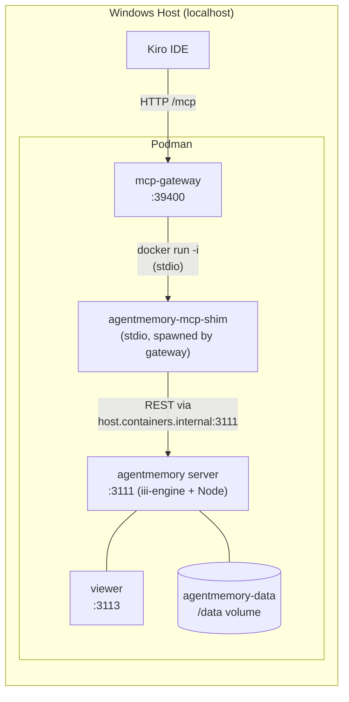

# agentmemory — Podman Local + MCP Gateway

Run agentmemory as a persistent Podman container on your Windows workstation,
route all MCP tool calls through your existing MCP Gateway, and have Kiro
consume it via the gateway's single HTTP endpoint.

## Architecture



**How it works:**
- The **agentmemory** container runs the full server (iii-engine v0.11.2 +
  Node worker + local embeddings) bound to `localhost:3111` and `:3113` (viewer).
- The **mcp-gateway** container spawns the pre-built `agentmemory-mcp-shim`
  image as a stdio backend (same pattern as fetch, aws-pricing, etc.).
- The **shim** proxies MCP tool calls to the agentmemory REST API via
  `http://host.containers.internal:3111`.
- Both the gateway and shim containers reach the agentmemory server through
  Podman's `host.containers.internal` loopback.
- **Kiro** sees agentmemory tools through the gateway — no separate MCP config needed.

## Quick Start

```powershell
cd d:\repo\agentmemory\deploy\podman-local
.\setup.ps1
```

This script:
1. Builds the container image from the Dockerfile
2. Creates a persistent `agentmemory-data` volume
3. Starts the container with `--restart unless-stopped`
4. Waits for health check, extracts the auto-generated HMAC secret
5. Prints the `gateway.yaml` snippet to add

## Manual Steps

### 1. Build the image

```powershell
cd d:\repo\agentmemory\deploy\podman-local
podman build -t agentmemory .
```

### 2. Create volumes and run

```powershell
podman volume create agentmemory-data
podman volume create agentmemory-secrets

podman run -d `
    --name agentmemory `
    --restart unless-stopped `
    -p "127.0.0.1:3111:3111" `
    -p "127.0.0.1:3113:3113" `
    -v "agentmemory-data:/data" `
    -v "agentmemory-secrets:/secrets" `
    agentmemory
```

### 3. Get the secret

The secret is generated inside the container on first boot and stored in
the `agentmemory-secrets` volume. It never leaves the volume layer — you
don't need to read or copy it. Both the server and the shim mount the
same volume.

To rotate: delete the secrets volume and restart:
```powershell
podman rm -f agentmemory
podman volume rm agentmemory-secrets
.\setup.ps1
```

### 4. Verify

```powershell
curl http://localhost:3111/agentmemory/health
```

### 5. Add to MCP Gateway

Add this backend to `~/.mcp-gateway/gateway.yaml` under `servers:`.

The gateway container spawns the pre-built `agentmemory-mcp-shim` image
as a stdio backend. The shim connects to the agentmemory server via
`host.containers.internal` (Podman's host-loopback address from inside containers).

The secret is stored in a dedicated `agentmemory-secrets` volume, separate
from the data volume. The shim mounts only the secrets volume read-only —
the data volume (SQLite, embeddings, streams) is never exposed:

```yaml
  agentmemory:
    transport: stdio
    command: docker
    args:
      - run
      - --rm
      - -i
      - -e
      - AGENTMEMORY_URL=http://host.containers.internal:3111
      - -v
      - agentmemory-secrets:/run/secrets:ro
      - agentmemory-mcp-shim
    description: "Agent persistent memory — save, recall, search, sessions"
    enabled: true
```

The shim reads `/run/secrets/.hmac` on startup and exports it as
`AGENTMEMORY_SECRET` internally. No secret appears in config files,
environment variables, or logs.

Then reload the gateway:
```
gateway_reload_config
```

### 6. Kiro already has it

Your Kiro `~/.kiro/settings/mcp.json` already points at the gateway
(`http://localhost:39400/mcp`). No changes needed — once the gateway
reloads, agentmemory tools appear automatically via `gateway_search_tools`.

## Tools Exposed via Gateway

The MCP shim in proxy mode exposes all 53 tools when it can reach the
server. The most useful ones for an agent in a coding session:

| Tool | What it does |
|------|------|
| `memory_smart_search` | Hybrid BM25 + vector search across all memory |
| `memory_save` | Save an insight, decision, or pattern |
| `memory_recall` | Search past observations by keyword |
| `memory_sessions` | List recent sessions |
| `memory_file_history` | Past observations about specific files |
| `memory_profile` | Project profile (top concepts, files, patterns) |
| `memory_timeline` | Chronological observation list |
| `memory_patterns` | Detect recurring patterns |
| `memory_export` | Export all memory data |
| `memory_relations` | Query relationship graph |

## Lifecycle

```powershell
# Stop
podman stop agentmemory

# Start
podman start agentmemory

# Logs
podman logs -f agentmemory

# Rebuild after agentmemory version bump
podman rm -f agentmemory
podman build --load -t agentmemory --build-arg AGENTMEMORY_VERSION=0.9.25 .
podman run -d --name agentmemory --restart unless-stopped `
    -p "127.0.0.1:3111:3111" -p "127.0.0.1:3113:3113" `
    -v "agentmemory-data:/data" -v "agentmemory-secrets:/secrets" agentmemory

# Nuke everything (data included)
podman rm -f agentmemory
podman volume rm agentmemory-data
podman volume rm agentmemory-secrets
podman rmi agentmemory agentmemory-mcp-shim
```

## Adding an LLM Provider Later

Mount an `.env` file into the container to enable compression/summarization:

```powershell
# Create the env file
New-Item -ItemType Directory -Force $HOME\.agentmemory
Set-Content $HOME\.agentmemory\.env "OPENROUTER_API_KEY=sk-or-..."

# Recreate with env file mounted
podman rm -f agentmemory
podman run -d --name agentmemory --restart unless-stopped `
    -p "127.0.0.1:3111:3111" -p "127.0.0.1:3113:3113" `
    -v "agentmemory-data:/data" `
    -v "$HOME\.agentmemory\.env:/opt/agentmemory/.env:ro" `
    agentmemory
```

## Troubleshooting

| Symptom | Fix |
|---------|-----|
| Gateway shows `agentmemory` with 0 tools | The shim can't reach `:3111`. Check `podman ps` — is the agentmemory server container running? Test from inside any container: `docker run --rm curlimages/curl http://host.containers.internal:3111/agentmemory/health` |
| `AGENTMEMORY_URL` connection refused | Both the gateway and the shim are in containers. They must use `host.containers.internal:3111`, not `localhost:3111`. |
| Secret mismatch / 401 from agentmemory | Both containers must mount the same `agentmemory-secrets` volume. Verify: `podman run --rm -v agentmemory-secrets:/run/secrets:ro agentmemory-mcp-shim cat /run/secrets/.hmac` |
| Port 3111 already in use | Another agentmemory / iii-engine is running. Kill it: `netstat -ano | findstr :3111` |
| Image build fails pulling iiidev/iii | Podman needs Docker Hub access. Check proxy/registry config. |
